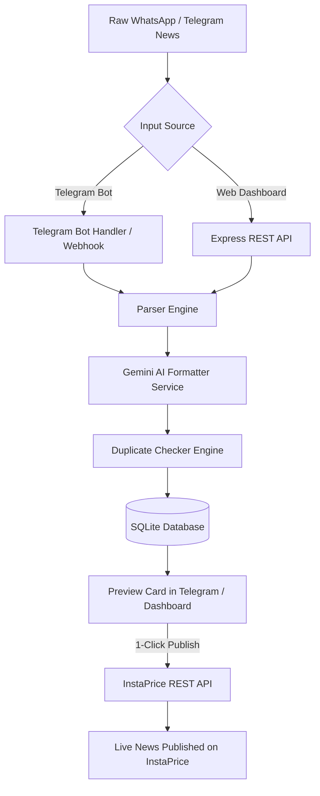

# 🚀 InstaPrice Polymer News Automation System

An automated WhatsApp/Telegram polymer price news parsing, formatting, duplicate detection, and 1-click InstaPrice publishing platform powered by **Node.js**, **Express**, **Google Gemini AI**, and **Telegraf**.

---

## ✨ Features

- 🤖 **Telegram Bot Integration**: Forward or paste raw WhatsApp polymer price update messages straight to your Telegram Bot.
- 🧠 **AI-Powered Formatting (Gemini 3.6 Flash)**: Automatically converts raw, unstructured polymer news text into standard InstaPrice HTML layout and formatted titles (with fallback regex support).
- 🔍 **Duplicate News Detection**: Checks historical records by company name, product, price change, and effective date to avoid publishing duplicate news items.
- 📊 **Interactive Web Dashboard**: Modern web console to view pending news drafts, parse custom text, live-edit titles or HTML content, and publish with 1 click.
- ☁️ **Vercel & Serverless Ready**: Native Vercel support with serverless entrypoints (`api/index.js`), `/tmp` SQLite storage, and Telegram Webhook integration (`/api/telegram-webhook`).
- 🧪 **Built-in Test Suite**: Execute end-to-end integration tests using `npm test`.

---

## 🛠️ System Architecture



---

## 📁 Directory Structure

```text
├── api/
│   └── index.js             # Vercel Serverless Function entry point
├── public/
│   └── index.html           # Admin Dashboard Web UI
├── src/
│   ├── bot/
│   │   └── telegramBot.js   # Telegraf Telegram Bot logic & webhook handler
│   ├── config/
│   │   └── config.js        # Environment configuration loader
│   ├── db/
│   │   └── database.js      # SQLite database initialization & helper functions
│   ├── services/
│   │   ├── duplicateChecker.js # Duplicate detection logic
│   │   ├── formatter.js       # Format generator router
│   │   ├── geminiFormatter.js # Google Gemini AI formatting service
│   │   ├── instapriceApi.js   # InstaPrice REST API client
│   │   └── parser.js          # Raw message parser (company, product, date, price)
│   ├── index.js             # Local Node.js server entry point
│   └── server.js            # Express app definition & REST API routes
├── test/
│   └── parser.test.js       # Integration & parser unit tests
├── .env.example             # Template environment variables
├── .gitignore               # Ignored files & secrets
├── package.json             # Node.js dependencies & scripts
├── vercel.json              # Vercel deployment configuration
└── README.md                # Project documentation
```

---

## ⚙️ Environment Variables

Copy `.env.example` to `.env` and configure the following variables:

| Variable | Description | Default / Example |
| :--- | :--- | :--- |
| `TELEGRAM_BOT_TOKEN` | Telegram Bot Token from [@BotFather](https://t.me/BotFather) | `8828576317:AAH...` |
| `INSTAPRICE_API_BASE_URL` | Base URL for InstaPrice REST API | `https://instamine.in/rest` |
| `INSTAPRICE_API_TOKEN` | Authentication Token for InstaPrice API | `chemer_news_...` |
| `DEFAULT_NEWS_IMAGE` | Default banner image filename | `1789970558.png` |
| `GEMINI_API_KEY` | Google Gemini API Key | `AQ.Ab8...` |
| `PORT` | Local server port | `3000` |
| `MOCK_MODE` | Set `true` for local sandbox mode without hitting live API | `false` |

---

## 🚀 Quick Start (Local Setup)

### 1. Prerequisites
- Node.js `v18+`
- npm `v9+`

### 2. Installation
```bash
git clone https://github.com/Balatechcode/InstaAutomais.git
cd InstaAutomais
npm install
```

### 3. Environment Setup
Create a `.env` file in the root directory:
```bash
cp .env.example .env
```
*(Fill in your `TELEGRAM_BOT_TOKEN`, `GEMINI_API_KEY`, and `INSTAPRICE_API_TOKEN`)*

### 4. Running the Project
- **Development Mode (Watch)**:
  ```bash
  npm run dev
  ```
- **Production Mode**:
  ```bash
  npm start
  ```

Open your browser at `http://localhost:3000` to access the Admin Dashboard.

### 5. Running Tests
```bash
npm test
```

---

## ☁️ Deployment on Vercel

This project is pre-configured for instant deployment on [Vercel](https://vercel.com).

### Step 1: Deploy with Vercel CLI
```bash
npx vercel --prod
```

### Step 2: Set Environment Variables on Vercel
Go to **Vercel Dashboard** -> **Project Settings** -> **Environment Variables** and add:
- `TELEGRAM_BOT_TOKEN`
- `INSTAPRICE_API_BASE_URL`
- `INSTAPRICE_API_TOKEN`
- `GEMINI_API_KEY`
- `MOCK_MODE` = `false`

### Step 3: Link Telegram Bot Webhook (Serverless Telegram Bot)
After deployment, set up your Telegram webhook so updates route directly to Vercel:

```text
https://api.telegram.org/bot<YOUR_TELEGRAM_BOT_TOKEN>/setWebhook?url=https://<YOUR-VERCEL-APP>.vercel.app/api/telegram-webhook
```

---

## 📡 API Reference

### `GET /api/health`
Returns system status and configuration mode.

### `GET /api/news`
Fetches historical news records from database.

### `POST /api/news/process`
Parses raw polymer update text and returns generated title, HTML preview, and duplicate status.

### `POST /api/news/:id/publish`
Publishes news draft directly to InstaPrice live REST API.

### `POST /api/telegram-webhook`
Handles incoming Telegram Bot update payloads in serverless mode.

---

## 📄 License
ISC License © 2026 Antigravity / InstaPrice Team
